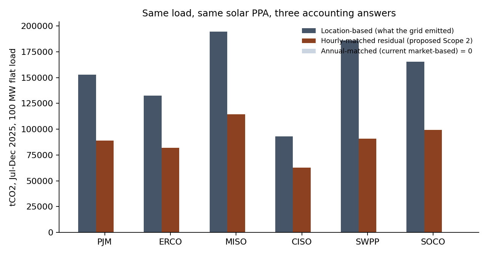

# Low-carbon feedstock for data-centre power: accounting, custody, and who pays

Working paper, code and a first pilot on the question behind the AI build-out: **when compute load arrives before the generation to serve it, who carries the cost, and can the pledges to carry it be measured?**

- **Paper:** [`article/low-carbon-feedstock-for-data-centres.md`](article/low-carbon-feedstock-for-data-centres.md)
- **Site-level model:** [`src/feedstock_ci.py`](src/feedstock_ci.py). Carbon intensity of electricity from a methanol-to-power unit with CO₂ capture as a function of feedstock origin, CO₂ fate and claim ownership, and `coproduct_value()`: what the captured tonne is worth per MWh by fate (merchant, e-fuel, mineralised, stored) with the claim kept separate from the price. Implements four accounting rules (claim exclusivity, fate follows the tonne, biogenic reported separately, measure the capture rate). Stoichiometry plus stated, sourced inputs; nothing proprietary.
- **Attribute ledger:** [`src/attribute_ledger.py`](src/attribute_ledger.py). The portfolio-level custody model from section 3 of the paper: one record from meter to claim (serial, factor, origin, custody model, fate, claim), the cancel-and-reissue rule at every handover, four claim types, and rejection of double claims, unsupported removal claims and off-hour certificates. Worked chain: bio-methanol certified in one country, converted to power in another, retired as an hourly-matched electricity claim.
- **Figures:** [`src/figures.py`](src/figures.py). Two Sankeys (carbon flow per tonne of fuel under two CO₂ fates; where a 100 MW load's energy goes under hourly matching in PJM), the custody-chain flowchart, and the portfolio ledger with the 2025–2028 rule timeline. Pure matplotlib.
- **Grid pilot:** [`src/hourly_match.py`](src/hourly_match.py). A flat 100 MW load in six US balancing authorities, July–December 2025, with a solar PPA sized to 100 % of annual energy. Emissions under location-based, annual-matched and hourly-matched accounting from EIA-930 hourly data.

## Headline result of the pilot

A solar PPA covering 100 % of a data centre's annual energy covers 42–48 % of its hours. The unmatched hours carry 49–67 % of the location-based emissions, depending on what runs in the dark hours. Under today's Scope 2 standard that load reports zero; under the hourly-matching revision expected in 2027 it does not.



| BA | Avg grid CI kg/MWh | Location-based tCO₂ | Hourly-matched residual tCO₂ | Hours matched |
|---|---|---|---|---|
| PJM | 348 | 152,800 | 88,900 | 43 % |
| ERCOT | 303 | 132,400 | 82,100 | 44 % |
| MISO | 443 | 194,500 | 114,500 | 43 % |
| CAISO | 212 | 93,100 | 62,600 | 44 % |
| SPP | 421 | 185,900 | 90,800 | 48 % |
| Southern | 374 | 165,200 | 99,300 | 42 % |

## The constructive thesis

Emerging technologies with a real industrial application, pre-combustion capture with a saleable CO₂ stream, methane pyrolysis to solid carbon, mineralisation into building materials, turn a disposal problem into a feedstock and can pay for decarbonising the firm power a data centre needs in the hours a solar contract does not cover. At illustrative prices the captured CO₂ is worth 45–115 $/MWh of the electricity that produced it. The accounting rules (one claim per tonne; only durable fates earn a claim) are what keep that value honest. Section 3 of the paper.

## Proposed research

1. **Measure the residual** for announced AI capacity using published large-load queues (ERCOT, utilities, EEI project list), LBNL Queued Up on the generation side, and marginal-emissions data (WattTime, Electricity Maps, Cambium) for a first consequential estimate.
2. **Compare the mechanisms** that try to make load internalise its cost: large-load tariffs (25 states), clean transition tariffs, hourly procurement mandates, flexibility tariffs, developer-funded upgrades, price-effect pledges. Classify by who bears what; test against the measured residual.
3. **Specify the measurement layer** that would let a pledge be audited: what is metered, matched, retired and verified.

Full framing in section 5 of the paper.

## Reproduce

```bash
pip install -r requirements.txt
# EIA-930 six-month balance file (public, ~48 MB):
curl -L -o data/EIA930_BALANCE_2025_Jul_Dec.csv \
  https://www.eia.gov/electricity/gridmonitor/sixMonthFiles/EIA930_BALANCE_2025_Jul_Dec.csv
python src/feedstock_ci.py     # site-level table -> figures/feedstock_ci.csv
python src/attribute_ledger.py # custody chain demo, prints the audit trail and three rejections
python src/figures.py          # Sankeys, flowchart, ledger + rule timeline -> figures/
python src/hourly_match.py     # grid pilot -> figures/hourly_match.csv, .png
```

## Provenance and limits

- Fuel emission factors are fleet averages (EIA), combustion only; the pilot is attributional, not consequential. No dispatch model yet.
- Solar shape is each balancing authority's own reported solar output; a contracted plant's shape would differ.
- Site-level fuel factors are illustrative ranges from IEA (2021) with the source next to each; replace with certified values for a real site.
- Standards: ISO 14067:2018; GHG Protocol Scope 2 Guidance (2015) and the 2025–26 revision consultation; GHG Protocol Corporate Standard App. B.

## Author

Svenja Telle. Environmental economist (Ph.D., University of Vermont). Founder of a carbon-accounting and certification platform for industrial fuels; UN-appointed expert, Paris Agreement Article 6.4; Industrial Advisor, NIST carbon-removal measurement consortium. The site-level case draws on advisory work in Singapore; counterparties are not named.

MIT licence.
