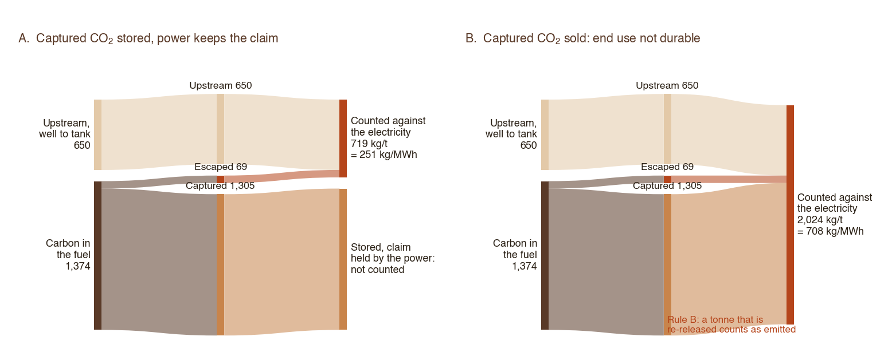
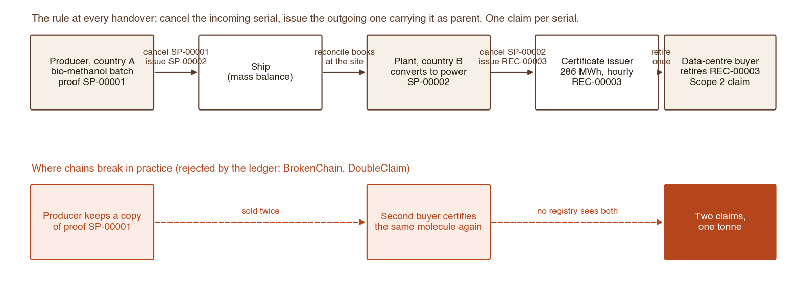
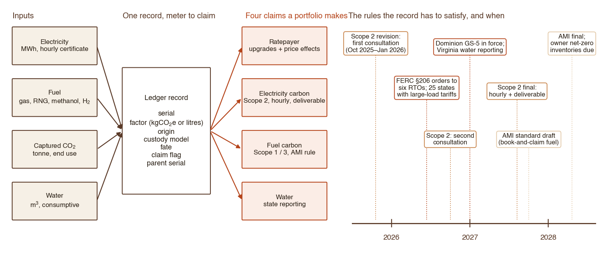
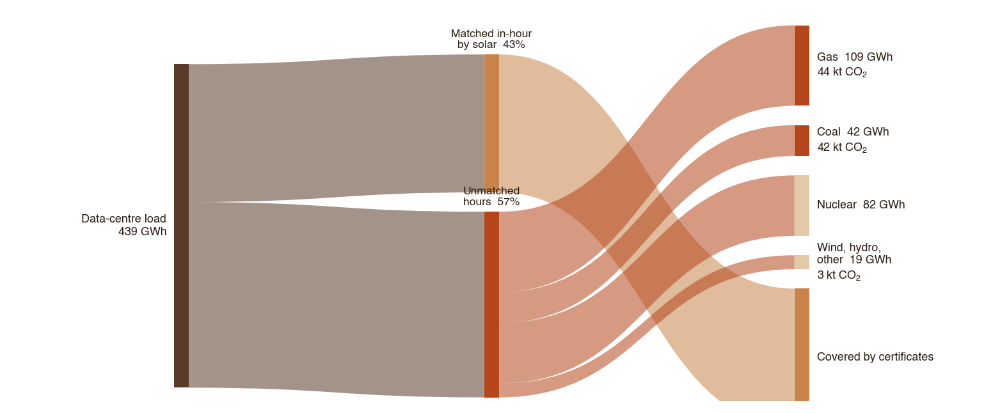

# Who pays for the electrons? Carbon, custody and the missing measurement layer under AI infrastructure

*Svenja Telle · September 2026 · Working paper. Code, data and figures at github.com/svetee/dc-feedstock-carbon. Comments welcome.*

## Summary

Frontier AI is being built on power that does not yet exist. Data centres arrive in two to three years; the generation and transmission to serve them take five to ten. In the gap, the load is served by whatever the grid already has, and the bill for upgrades lands on a rate base that did not ask for them. The largest AI developers have responded with pledges: to pay for grid upgrades, to bring new generation online, to cover the price effects their load causes, to run on clean power [1, 2]. None of the pledges I have read names a methodology, a data source or an auditor. That is not a criticism of the pledges. It is the gap this paper is about.

I make four arguments, drawn from fourteen years in carbon accounting, the last two spent on fuels and on-site power for data centres.

1. **At the site, the carbon intensity of "low-carbon" power is a contract term, not a property of the technology.** A worked case with a methanol-to-power unit and CO₂ capture shows the same plant producing electricity at 250 or 700 kgCO₂e/MWh depending on three clauses: where the carbon came from, where the captured CO₂ goes, and who holds the claim on it.
2. **Integrating emerging conversion technologies into the feedstock supply chain is what makes firm low-carbon power affordable.** Reforming with capture yields a pure CO₂ feedstock; methane pyrolysis yields hydrogen and solid carbon. At illustrative prices the product is worth 45 to 115 dollars per MWh of electricity for CO₂ and 150 to 300 for carbon-black-grade solid carbon, the order of the cost premium for firm power. The value does not depend on the carbon being locked away; durability decides only what the electricity may claim.
3. **Across a portfolio, the accounting problem is a chain-of-custody problem.** Fuel, electricity and CO₂ attributes cross borders, registries and standards. The chain breaks at the handovers, and the fix is one record from meter to claim, not a better spreadsheet.
4. **The rules that will decide who pays are being written now, without the measurement to apply them.** A pilot on public hourly grid data shows that a solar PPA sized to 100 % of a data centre's annual energy leaves 49 to 67 % of its location-based emissions unmatched hour by hour, depending on what serves the dark hours in each region. Under the current standard that load reports zero. Under the standard expected in 2027 it does not. The difference is the size of the policy question.

The paper ends with the research I propose to do next: measuring the societal cost of compute load, and testing which market mechanisms make AI infrastructure fund grid resilience rather than draw on it.

---

## 1. Load before generation

Three facts frame the problem.

**Large loads have become a rate class.** By September 2026, 25 US states had approved at least one large-load tariff and seven more had tariffs pending; the count of approved and proposed tariffs and service rules grew from 41 in July 2025 to 104 in July 2026 [3, 4]. Several carry statutory cost-bearing terms. Dominion Virginia's GS-5 class, effective 1 January 2027, applies to customers above 25 MW with a 14-year minimum term, minimum charges on 85 % of contracted transmission demand and 60 % of generation demand, and collateral of about US$1.5 million per MW; AEP Ohio's data-centre tariff carries an 85 % take-or-pay minimum over 12 years [4, 5]. On 18 June 2026 FERC issued show-cause orders under section 206 of the Federal Power Act to all six RTOs and ISOs it regulates, with the preliminary finding that their tariffs lack adequate provisions for loads above 50 MW connecting above 69 kV, and asked how each will ensure generation adequacy for new large loads [6, 7]. In ERCOT, outside FERC's jurisdiction, the large-load queue stood at roughly 410 GW in March 2026, 87 % of it data centres, against about 9 GW approved to energise [8]. The money is not hypothetical. PJM's independent market monitor attributed 63 % of the price increase in the 2025/26 capacity auction to data-centre load, about US$9.3 billion carried by the region's ratepayers in one delivery year [20]. Who pays is being decided docket by docket.

**The carbon accounting standard is changing underneath the pledges.** The GHG Protocol's revision of the Scope 2 Guidance, consulted on from 20 October 2025 to 31 January 2026 with a second consultation due in 2026 and a final standard expected in 2027, proposes that a certificate can back a market-based claim only if it matches the hour of consumption and comes from a deliverable region [9, 10]. Hourly certificates already exist in PJM-GATS and M-RETS [10]. The consultation draft states that "the hourly matched inventory will usually be higher than the annually matched inventory unless clean energy attributes are procured for all hours" [9]. Every AI data centre being financed today will report under the new rule for most of its life.

**The pledges have no measurement layer.** Take the most specific one on record. Anthropic's statement of 11 February 2026 commits to "pay for 100% of the grid upgrades needed to interconnect our data centers," to "bring net-new power generation online to match our data centers' electricity needs," and, where new generation is not online, to "work with utilities and external experts to estimate and cover demand-driven price effects from our data centers" [1]. Microsoft and OpenAI made comparable commitments in the preceding weeks [2]. Each clause needs a method the text does not supply. "Cover the price effects" requires attributing wholesale and retail price movements to a specific load, using interconnection cost studies, PUC dockets and market data. "Match" requires a definition: annual energy, capacity, or hour by hour. "Pay for the upgrades" requires an allocation of shared network costs that the RTO dockets above are still contesting. None of this exists as a public method, so each pledge will be honoured in the currency the pledging party chooses, and no regulator or ratepayer can check the arithmetic.

## 2. At the site: carbon intensity is a contract term

I use methanol-to-power as the worked case because it is where the contract-term effect is largest and fully visible; the same rules apply to renewable natural gas, certified gas and gas with capture. Consider a data centre that wants firm, on-site, low-carbon power and chooses a liquid fuel: methanol, reformed on site, with the CO₂ captured before combustion and the hydrogen run through a fuel cell. Several such units are in development in Asia, including one I have advised on the accounting for. The technology is three known pieces: a reformer with pre-combustion capture, a fuel cell, and a heat loop that makes the cell's waste heat do the capture work. The engineering question is capture rate and parasitic load; independent technical reviews of comparable systems expect 95 to 99 % capture rather than the 100 % that developers' models tend to assume. The accounting question is harder.

The electricity's carbon intensity, in kilograms of CO₂e per MWh from well to plug, depends on:

- **Origin of the carbon.** Fossil methanol carries a well-to-tank footprint of roughly 0.6 to 0.7 tCO₂e per tonne before combustion and fossil carbon in the molecule; bio-methanol a smaller footprint and biogenic carbon; e-methanol in a closed loop only the energy of making it [11].
- **End use of the captured CO₂.** Only durable end uses keep the tonne out of the air: geological storage, mineralisation into concrete. Sale to a beverage bottler, sale as e-fuel feedstock, or venting all return the carbon within months. In accounting terms those three are the same as not capturing.
- **Who holds the claim.** A captured tonne can be claimed once. If the CO₂ buyer takes the claim (as a removal credit, say), the electricity is accounted as if the CO₂ had been released.

The accounting boundary is the product carbon footprint under ISO 14067 [12]; the buyer's figure is its market-based Scope 2 under the GHG Protocol Scope 2 Guidance [13]; biogenic CO₂ is reported outside the scopes under Appendix B of the Corporate Standard [14]. Four rules follow, and I have found each of them contested in practice:

| Rule | Statement | Where it is usually broken |
|---|---|---|
| A. Exclusivity | The captured tonne is claimed by the power *or* the CO₂ buyer, by contract, never both | Power contract promises "decarbonised" MWh while the CO₂ offtake contract sells credits |
| B. The claim follows the end use | Credit only for durable end uses | Merchant CO₂ sales counted as abatement |
| C. Biogenic separate | Biogenic CO₂ reported outside the scopes; a removal is a separate product, never netted into the buyer's Scope 2 | "Negative" electricity figures offered to the buyer |
| D. Measure, do not assume | Capture rate and parasitics are measured inputs | 100 % capture in the model; engineering reviews expect 95–99 % |

`src/feedstock_ci.py` implements these rules on stoichiometry (1.374 t CO₂ per t methanol on full oxidation), a stated conversion efficiency, capture rate and parasitic share, with each fuel factor sourced and marked illustrative. The output for one plant configuration:

| Feedstock | CO₂ end use | Claim held by | Electricity, kgCO₂e/MWh | Removal, separate | 
|---|---|---|---|---|
| Fossil methanol | sold (merchant) | power | **708** | 0 |
| Fossil methanol | stored | power | **251** | 0 |
| Fossil methanol | stored | CO₂ buyer | **708** | 0 |
| Bio-methanol | vented | power | **105** | 0 |
| Bio-methanol | stored | power | **105** | 457 |
| E-methanol, closed loop | returns as fuel | power | **37** | 0 |

For reference, the published grid emission factor for Singapore, a gas-fired system, is 417 kgCO₂/MWh [15] and a gas combined-cycle plant is about 500 well-to-plug once upstream methane is counted. The point of the table is not the numbers, which move with the plant's efficiency and the fuel factors. It is that rows one and three are the same physical plant. What separates 251 from 708 is a clause in the CO₂ offtake agreement. A buyer signing a PPA for "low-carbon" power from such a unit is signing for a range until the end use and the claim are fixed in writing.

The same logic applies to every low-carbon feedstock now being offered to data centres: certified natural gas, renewable natural gas under book-and-claim, gas with post-combustion capture, hydrogen blends. In each case the carbon intensity the buyer may report depends on custody rules and claim rules more than on the molecule.

## 3. Integrate the conversion technology into the feedstock supply chain

Section 2 treated the plant as a power source with an accounting problem attached. That is the wrong frame for the technologies now arriving, and it is the frame that makes on-site low-carbon power look unaffordable. The better frame is the supply chain: the data centre's fuel is converted on or near the site by a process that yields energy and an industrial product, and the product goes into someone else's supply chain as a feedstock. Two families of technology do this today.

The first is the reforming-with-capture unit of section 2. Methanol comes in; hydrogen goes to a fuel cell; a stream of pure, pressure-ready CO₂ comes out, about 0.46 tonnes per MWh of electricity. Pure CO₂ is a feedstock for food and beverage, greenhouses, dry ice, methanol and urea synthesis, e-fuels, and carbonated building materials. The second is turquoise hydrogen: methane pyrolysis, which splits the fuel into hydrogen and solid carbon and never makes CO₂ at the plant at all. Per MWh of electricity from that hydrogen the plant yields roughly 0.16 tonnes of solid carbon, which is carbon black at the low end and graphite or nanocarbon at the high end, feedstocks for tyres, batteries, composites and concrete.

Exhibit 4 puts illustrative prices on both [21]. For the capture unit, CO₂ sold as an industrial feedstock is worth 45 to 115 dollars per MWh of the power that produced it; as e-fuel feedstock, 25 to 70; mineralised into aggregates the gas itself fetches little, though where the carbon is biogenic the durable-removal claim is worth another 45 to 135. For the pyrolysis unit, carbon-black-grade solid carbon is worth 150 to 300 dollars per MWh, and higher grades several times that. Against a cost premium for firm low-carbon power that, in the developer models I have reviewed, runs from roughly 40 to 120 dollars per MWh (illustrative; the comparison matters, not the figure), the product is not a side line. It is what makes the firm supply affordable.

| Conversion route | Product | Product per MWh | Product value, USD/MWh | What it displaces in the receiving chain | Claim on the electricity |
|---|---|---|---|---|---|
| Reforming with capture | CO₂, merchant (food, industrial, greenhouse) | 0.46 t | 45 to 115 | CO₂ from ammonia and ethanol plants, often vented otherwise | None: the carbon is re-released |
| Reforming with capture | CO₂, e-fuel feedstock | 0.46 t | 25 to 70 | Fossil carbon in the fuel that is made | None at the plant; the e-fuel carries the origin |
| Reforming with capture | CO₂, mineralised (aggregates, concrete) | 0.46 t | 0 to 25, plus 45 to 135 removal claim if biogenic | Virgin aggregate; cement-cured concrete | Kept, unless the claim is sold with the tonne |
| Reforming with capture | CO₂, geological storage | 0.46 t | −25 to −10 | Nothing | Kept |
| Methane pyrolysis (turquoise H₂) | Solid carbon, carbon-black grade | 0.16 t | 150 to 300 | Furnace carbon black at about 2.4 tCO₂e per tonne, roughly 0.4 tCO₂e per MWh | No CO₂ is made; the electricity carries only the gas's upstream footprint |
| Methane pyrolysis (turquoise H₂) | Graphite or nanocarbon grades | 0.16 t | 500 to 1,600 | Synthetic graphite and mined natural graphite | As above |

Three things follow, and they are the constructive half of this paper.

First, **the value of the integration does not depend on the carbon being locked away for ever.** A tonne of CO₂ sold to a bottler is re-released in months and earns the power no claim, and it still displaces a tonne that an ammonia plant would have vented, still earns the revenue that pays for the firm supply, and still keeps a fossil molecule out of the merchant market. A tonne of solid carbon from pyrolysis displaces furnace carbon black made at about 2.4 tonnes of CO₂ per tonne. Durability decides one thing only: whether the electricity itself may claim the captured tonne. It does not decide whether the integration is worth doing. The mistake I see in both directions is to let the claim question stand in for the value question, either by counting a merchant sale as abatement (Rule B) or by dismissing a non-durable end use as worthless.

Second, **the accounting has to be built for a multi-product plant from the start.** A process that yields electricity and a feedstock needs an allocation rule between them (ISO 14067 allows physical or economic allocation and requires the choice to be stated), a custody record for the product so its origin travels with it into the receiving supply chain (biogenic CO₂ is worth more to an e-fuel maker than fossil CO₂; solid carbon from biomethane is worth more than from natural gas), and the claim rules of section 2 so that the same carbon is not credited to the power, the product and the buyer at once. This is the same ledger as section 4, applied one step earlier in the chain.

Third, **this is a market mechanism for resilience.** A data-centre operator who must buy firm power under an hourly rule, and who has an industrial gas or materials market within reach, has a revenue stream that makes the grid-independent low-carbon option the cheaper one. The integration funds the firm supply that the rule demands, and it does so out of other industries' demand for feedstock rather than out of the ratepayer's bill. The research in section 6 is about who pays for the residual; this section is the answer I would want it to test.

## 4. Across the portfolio: custody

Now follow the molecule across a border. In the Asian case the bio-methanol is made from waste biomass in one country, shipped to another, converted to power, and the renewable attribute is turned into a certificate the data-centre buyer retires. There are at least two readings of that chain, with two or three handovers each, and the rule at every handover is the same: cancel the incoming certificate, issue the outgoing one with the incoming serial on it. The place chains break is the first handover, where a producer keeps the sustainability proof and sells it to a second buyer while the same molecule is certified again downstream.

A US hyperscale portfolio has the same structure at larger scale. Its inputs are electricity (with certificates, soon hourly), fuel (gas, RNG, certified gas, hydrogen, each with its own registry and custody model), captured CO₂ (with its own registries), and water. Its claims are of four kinds: a ratepayer-protection claim, an electricity-carbon claim, a fuel-carbon claim and a water claim. Whether book-and-claim fuel attributes may enter Scope 1 and 3 at all is the subject of the GHG Protocol's separate Actions and Market Instruments work, which the Scope 2 consultation moved avoided-emissions and VPPA claims into [9].

The infrastructure this needs is not complicated to describe. Each unit of input carries a serial, an emission or water factor, a custody model (mass balance or book-and-claim) and a claims flag, from the meter to the retired certificate. `src/attribute_ledger.py` implements the rule in eighty lines: cancel on handover, reissue with the parent serial, one claim per serial, no removal claim without biogenic carbon and a durable end use, no electricity claim on a certificate from another hour or region. I proposed this design to a US data-centre platform this year; it has not been built, and the code here is the generic form.

### What a portfolio ledger has to carry

The design was written for a common situation: a platform with a single large tenant, financial owners with net-zero policies, sites still to be chosen, and a public pledge on ratepayer cost with no method behind it. Three things followed, and they generalise.

- **Four claims, one record.** The ratepayer claim (upgrade costs and price effects), the electricity-carbon claim (Scope 2, soon hourly and deliverable), the fuel-carbon claim (Scope 1 and 3, pending the AMI rule on book-and-claim) and the water claim (state reporting) all draw on the same metered inputs. A separate spreadsheet per claim is how double counting starts.
- **The record outlives the hardware.** A data centre replaces its GPUs generation by generation; the asset that persists is the record. Embodied carbon and asset accounting belong on the same serial as the operating attributes.
- **The rules move faster than the build.** Exhibit 6 shows the sequence: Scope 2 consultation, FERC and state tariffs, Dominion GS-5 and Virginia water reporting in 2027, Scope 2 final, the AMI draft and final, the owners' inventory deadlines. A site financed in 2026 will report under rules that are not yet written for most of its life, so the record has to carry the raw hourly data, not a factor computed under today's rule.
 It is complicated to build, because the registries do not talk to each other and the standards are moving. But without it, every one of the pledges above is unauditable, and the net-zero frameworks that infrastructure investors have adopted, which typically require a measured inventory and a Paris-aligned plan within two years of acquisition, cannot be met [16].

## 5. The pilot: reporting or emissions?

The most consequential of the moving standards is hourly matching, because it changes what a data centre's clean-power procurement is worth. I ran a first test on public data.

**Method.** EIA Form 930 gives hourly net generation by fuel for each US balancing authority [17]. I built an hourly grid carbon intensity from fuel shares and fleet-average combustion factors (coal 1,000, gas 400, petroleum 900 kgCO₂/MWh, from EIA's fleet-average emission rates [18]; zero for nuclear, hydro, wind, solar, storage at the point of generation). I placed a flat 100 MW load in six balancing authorities for July to December 2025 and gave it a solar PPA sized so that solar energy over the period equals load energy, using each region's own solar shape. Then I computed the load's emissions three ways: location-based (load times hourly grid factor), annual-matched market-based (zero, since certificates cover the year), and hourly-matched (unmatched hours at the grid factor). The code is `src/hourly_match.py`; nothing is fitted. Two limits to state up front: the grid factor is built from each balancing authority's own generation and ignores interchange, which understates CAISO's imports; and the matched share is close to arithmetic, since solar produces in roughly 42 to 48 % of hours everywhere, so the result that carries information is the carbon-weighted residual, which depends on what runs in the dark hours.

| Balancing authority | Avg grid CI, kg/MWh | Location-based, tCO₂ | Hourly-matched residual, tCO₂ | Share of load matched by the hour |
|---|---|---|---|---|
| PJM | 348 | 152,800 | 88,900 | 43 % |
| ERCOT | 303 | 132,400 | 82,100 | 44 % |
| MISO | 443 | 194,500 | 114,500 | 43 % |
| CAISO | 212 | 93,100 | 62,600 | 44 % |
| SPP | 421 | 185,900 | 90,800 | 48 % |
| Southern | 374 | 165,200 | 99,300 | 42 % |

A solar PPA that covers 100 % of annual energy covers 42 to 48 % of the hours. The residual, 49 % of the location-based figure in SPP and 67 % in CAISO, is what the current standard lets a buyer leave unreported and the proposed standard does not. In MISO that is 114,000 tCO₂ over six months for a single 100 MW site. Where that residual is emitted matters as much as its size: the unmatched hours are served by gas and coal plants in the same region, so the air-quality and water burden of a certificate-backed "zero" lands on the communities near those plants, not on the buyer's report.

**What this does and does not show.** It shows that hourly matching changes reporting by a large, region-dependent amount, and that the residual is served by gas and coal in the hours solar is absent. It does not yet show the consequential effect: whether the load caused those plants to run, what it did to prices, or whether an hourly-matched procurement rule would change what gets built. The residual is a reporting quantity; whether it is an emission the load caused is the first research question below. One more consequence follows from the arithmetic. An hourly rule does not remove the residual; it converts it into demand for firm low-carbon supply, which is exactly the contract-term product of section 2, and the co-product economics of section 3 are what make that supply affordable. The custody problem returns at scale.

## 6. Proposed research: the societal cost of compute, and who pays

Frame the question as one of societal resilience rather than corporate accounting. The threat here is not the model but its deployment: AI load that raises household bills and erodes grid adequacy is the fastest route to public and regulatory backlash against the build-out itself, and grid reliability is critical infrastructure in its own right. Market mechanisms that make the load fund resilience rather than draw on it are the test case for whether an AI developer's pledges can be verified by anyone outside the developer.

Compute load is arriving faster than generation. The costs land on four parties: ratepayers (price effects and upgrade costs), the grid (adequacy and reliability in the hours renewables are absent), communities near generation and sites (local emissions and water), and the climate (the residual above, to the extent it is caused rather than reported). The pledges say the developer will carry these costs. The regulatory system is deciding, tariff by tariff, how much of them it will be made to carry. Neither side has a measurement.

Three questions, in order:

**1. Measure the residual.** Extend the pilot from a flat load in six regions to announced capacity: the large-load queues that ERCOT and a growing number of utilities now publish [8], the EEI list of large-customer projects [3], and, on the supply side, LBNL's Queued Up dataset of generation and storage seeking interconnection (1,312 GW of generation and 749 GW of storage at the end of 2025; it covers generators, not loads) [19]. For the consequential question, use published marginal-emissions data (WattTime, Electricity Maps, NREL Cambium) as the first pass and leave dispatch modelling as a stated extension. Output: a public, reproducible estimate of the hourly-matched residual and the price-effect exposure of announced AI capacity, by region.

**2. Compare the mechanisms.** Large-load tariffs, clean transition tariffs, hourly-matched procurement mandates, curtailable-load and flexibility tariffs, developer-funded upgrade programmes and "pay the price effect" pledges are all attempts to make the load internalise its cost. They allocate it differently, and some work against each other: an 85 % take-or-pay minimum prices against the flexibility that the curtailment commitments in the pledges rely on. Using the PUC docket record (the DELTa database now summarises 104 approved and pending tariffs across more than 70 utilities [4]) and the six RTOs' responses to the FERC show-cause orders [6], classify the mechanisms by who bears what, and test them against the measured residual from question 1. Output: an evidence-based typology that a policymaker or a developer can use to say which mechanism buys resilience and which only moves cost.

**3. Specify the measurement layer.** For the mechanism that performs best, write the minimum data and custody specification that would let a pledge be audited: what is metered, what is matched, what is retired, who verifies. This is where the site-level and portfolio-level work above becomes a public good instead of a consulting deliverable.

**Sequence and deliverables, four months.** Weeks 1 to 4: extend the pilot to announced capacity in three balancing authorities and publish it as a public notebook (deliverable 1, week 4). Weeks 5 to 10: the mechanism typology from the DELTa database and the six RTO filings, tested against the residual (deliverable 2). Weeks 11 to 16: the measurement specification and the paper (deliverable 3). If the residual turns out not to vary materially across mechanisms, that is the finding, and it is worth publishing: it would mean the allocation debate is about money and not about emissions.

Every input is public: EIA-930, the RTO and utility large-load queues, DELTa, the PUC and FERC dockets, the marginal-emissions datasets. Nothing in the plan needs proprietary data or a proprietary system, and every output will be public. The methods are standard: panel and event-study designs on hourly and docket data, with the accounting rules implemented as code so that the choices are inspectable. What I bring is fourteen years of building exactly these accounting rules for regulators and buyers, which is how I know where the rules break.

---

*Author's note.* The site-level case draws on advisory work for a methanol-to-power developer and its data-centre counterparty in Asia, and on proposal work for a US data-centre platform. Counterparties are not named; all site numbers are illustrative and are generated by the code in this repository from stated inputs.

## References

1. Anthropic, "Covering electricity price increases," 11 February 2026. anthropic.com/news/covering-electricity-price-increases
2. NBC News, "Anthropic to cover costs of electricity price increases from its data centers," 11 February 2026 (noting comparable commitments by Microsoft and OpenAI in the preceding month). nbcnews.com/tech/tech-news/anthropic-cover-costs-electricity-price-increases-data-centers-rcna258554
3. Edison Electric Institute, "Large Load Projects and Tariffs," August 2026; EEI, "Electric companies stepping up to protect customers amid data center buildout," 2026. eei.org
4. SEPA and NC Clean Energy Technology Center, Database of Emerging Large-Load Tariffs (DELTa), Q2 2026 update; SEPA, "Stretching the possibilities: where large-load tariffs fit in the future of data center flexibility," September 2026. sepapower.org
5. Columbia Law School, Sabin Center Climate Law Blog, "Data center regulation: what local governments should know about large-load tariffs and clean transition tariffs," 2 June 2026. blogs.law.columbia.edu/climatechange
6. Federal Energy Regulatory Commission, "FERC launches aggressive targeted action to speed large load integration," news release, 18 June 2026; show-cause orders under FPA §206 to PJM, MISO, SPP, CAISO, ISO-NE and NYISO. ferc.gov
7. Vinson & Elkins, "FERC institutes six simultaneous section 206 proceedings targeting large load interconnection across all RTO/ISO markets," June 2026; Bracewell, "FERC show cause orders on large load interconnection," June 2026.
8. ERCOT, "Large Load Update," Senate Committee on Business & Commerce hearing, 1 April 2026 (ercot.com/files/docs/2026/04/01/ERCOT_LargeLoad_Update_April2026_B-C_-Hearing.pdf); Utility Dive, "ERCOT's large load queue jumped almost 300% last year," 2026.
9. GHG Protocol, "Public Consultation: Scope 2," October 2025 (ghgprotocol.org/sites/default/files/2025-10/GHG-Protocol-Scope2-Public-Consultation.pdf); GHG Protocol, "GHG Protocol opens public consultations on Scope 2 and electricity sector consequential accounting," 20 October 2025.
10. GHG Protocol, "Upcoming Scope 2 public consultation: hourly matching and deliverability," 2025; WattTime, "GHG Protocol Scope 2 revision," 2026. ghgprotocol.org; watttime.org
11. International Renewable Energy Agency and Methanol Institute, *Innovation Outlook: Renewable Methanol*, IRENA, Abu Dhabi, 2021.
12. ISO 14067:2018, *Greenhouse gases — Carbon footprint of products — Requirements and guidelines for quantification*.
13. WRI/WBCSD, *GHG Protocol Scope 2 Guidance*, 2015.
14. WRI/WBCSD, *The Greenhouse Gas Protocol: A Corporate Accounting and Reporting Standard*, revised edition, 2004, Appendix B (biogenic CO₂).
15. Energy Market Authority of Singapore, Singapore Energy Statistics, grid emission factor (operating margin), latest published year. ema.gov.sg
16. Institutional Investors Group on Climate Change, *Net Zero Investment Framework 2.0*, infrastructure component (inventory and Paris-aligned plan requirements for portfolio companies).
17. U.S. Energy Information Administration, Form EIA-930, "Hourly and Daily Balance for a Balancing Authority," six-month file July–December 2025. eia.gov/electricity/gridmonitor
18. U.S. Energy Information Administration, "How much carbon dioxide is produced per kilowatthour of U.S. electricity generation?", Frequently Asked Questions, 2024 data.
19. Lawrence Berkeley National Laboratory, *Queued Up: 2026 Edition. Characteristics of Power Plants Seeking Transmission Interconnection as of the End of 2025*, June 2026, with project-level data file (May 2026). emp.lbl.gov/queues
20. Monitoring Analytics (PJM Independent Market Monitor), analysis of the 2025/2026 Base Residual Auction, reported in Utility Dive, "Data centers 'primary reason' for high PJM capacity prices: market monitor," 2025.
21. International Energy Agency, *Putting CO₂ to Use: Creating Value from Emissions*, Paris, 2019 (CO₂ utilisation markets and price ranges); carbon-removal offtake price ranges from public 2025 purchase disclosures, illustrative.
